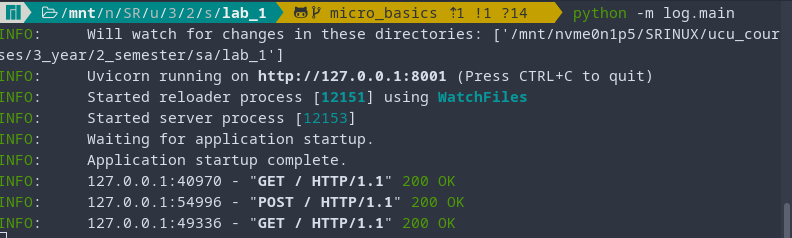

# Lab 1: Microservices Basics

### Setup

- Host and ports configs are in the [json file](services_config.json)
- Install [requirements.txt](requirements.txt)

### Running

In the root project directory run each service:
- `python -m facade.main`
- `python -m log.main`
- `python -m models.main`

Send requests via `curl`:
- e.g. send GET request to the Facade:  
    `curl http://127.0.0.1:8000/`
- e.g. send POST request to the Facade:  
    `curl -d '{"msg":"facade"}' -H "Content-Type: application/json" -X POST http://127.0.0.1:8000/`

### Results

1. Startup all the services

2. 
   1. Send GET to the `log`:
   

   2. Send POST to the `log`:
   

   3. Send GET to the `log`:
   

   4. Log output:
   

3. 
   1. Send GET to the `messages`:
   

   2. Send POST to the `messages` (as we should not implement it):
   

   3. Messages output:
   

4. 
   1. Send GET to the `facade`:
   

   2. Send POST to the `facade` 2 times:
   

   3. Send GET to the `facade`:
   
   
   4. All services output:
   